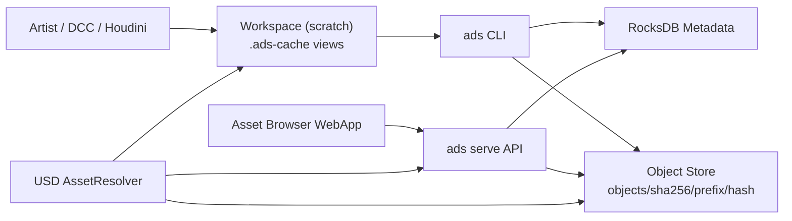
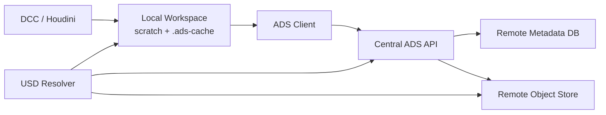
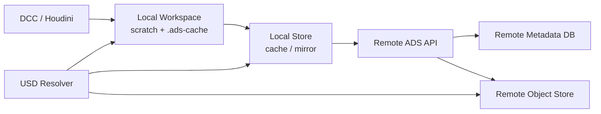

# ADS White Paper

## Rust製アセットバージョニングシステム

作成日: 2026-05-26  
最終更新: 2026-06-11

対象実装: ADS schema version 8(WIP/Publishモデル、`docs/SPEC_WIP_PUBLISH.ja.md`)
実務手順: `docs/WORKFLOW.ja.md`(作業フローマニュアル)

## Executive Summary

ADSは、DCCツール、特にUSDを扱う制作環境向けの軽量なアセットバージョニングシステムです。Rust製の単一バイナリとして提供され、ローカルファイルシステム上にRocksDBベースのメタデータDBとcontent-addressed object storeを構築します。

中心となる考え方は、すべての書き出しを一意なパスへ分離し(Never Overwrite)、正規履歴をcontent-addressed object storeとmetadataに保持することです。versionは2層に分かれます。

```text
WIP層     書き出し1回 = 1 micro-version(local限定、GC対象)
Publish層 整数番号を持つ公開version(current/latest、remote push対象)
```

USDファイル、特にusdcはアプリケーションが開いている間ロックされ、上書きできないことがあります。ADSは同一パスを更新し続けるのではなく、書き出しごとに一意なstagingパスへ書いてWIP micro-versionとして登録するため、ロック問題は構造的に発生しません。publishはWIPへの番号付与(メタデータ昇格)であり、ファイルコピーを伴いません。

また、USD AssetResolverを前提にした論理パスもサポートします。制作データ内では `ads://hero/model/hero.usd` のような短いURIを使い、実際にどのversion、どのローカルパス、どのObjectStorage URLへ解決するかはADS側で吸収する設計です。現状実装ではHoudini 21.0.700向けC++ `ArResolver` pluginにより、local workspace解決とremote object direct readの両方を検証済みです。

schema version 8(WIP/Publishモデル)への移行は実装済みです。versionフォルダはworkspace契約から外れ、頻繁なローカル書き出しはWIP micro-versionとして登録され、publishはコピーゼロのメタデータ昇格(`publish promote`)になりました。決定の経緯と詳細仕様は「設計改訂(schema version 8)」の章および `docs/SPEC_WIP_PUBLISH.ja.md` を参照してください。

## 背景と課題

### DCC制作におけるアセット管理の難しさ

3D制作では、ひとつのアセットがmodel、rig、anim、lookdev、fxなど複数の作業区分に分かれます。さらに各作業区分は複数versionを持ち、USD、テクスチャ、補助ファイル、プレビュー画像などをフォルダ単位で扱うことが多くあります。

従来の一般的なVCSやPerforce型の運用では、同一ファイルパスを更新し、checkoutやlockで編集権を管理する方式が多く使われます。しかしUSDやDCCツールでは、ファイルを開いている状態のロック、アプリケーション固有のI/O挙動、共有ストレージ上の挙動差が問題になることがあります。

ADSはこの問題に対して、次の前提を置きます。

- 管理単位はファイルではなくフォルダ。
- 作業フォルダはversionごとに物理的に分ける。
- 登録済みversionは原則として同一内容を保つ。
- 正規データはobject storeに保存し、workspaceは作業用コピーとする。
- USDファイル内の参照はResolverで抽象化し、version指定を必要最小限にする。

## 設計原則

以下はschema version 7までの設計原則です。現行実装はschema version 8であり、次章「設計改訂(schema version 8)」の改訂後原則が適用されます。本章は設計の経緯として残しています。

### 1. Version Folder First

ADSのworkspaceは、常にversionフォルダを持ちます。

```text
category/asset_code/department/v###
```

`department` は作業区分を表します。例えば `model`, `rig`, `anim`, `lookdev`, `fx` です。

この構造により、`v001` をHoudiniで開いたままでも、`v002` を別フォルダとして作成できます。既存versionを上書きしないため、USDファイルのロックやDCCアプリケーションの保持状態から正規ストアを守れます。

注: この原則はschema version 8で撤回が決定しています。上書き保護の実体はcontent-addressed storeへ移っており、versionフォルダはworkspace契約から外れます。詳細は「設計改訂(schema version 8)」の章を参照してください。

### 2. Store Is Canonical

workspaceのversionフォルダは作業用実体です。正規履歴はstoreにあります。

```text
<store>/
  db/
  objects/
    sha256/
      ab/
        abcd...
```

RocksDBはasset、version、manifest、current pointer、thumbnail metadataを保持します。実ファイル内容はSHA-256でcontent-addressed object storeに保存されます。

### 3. Content Deduplication

ファイル内容はSHA-256でハッシュ化され、同一内容のファイルは同一objectを参照します。version間で変更されていないファイルは再保存されません。

manifestは、フォルダ内の相対パス、ファイルサイズ、SHA-256、簡易modeから構成されます。ファイル走査順に依存しない安定したmanifest hashを作るため、entryは正規化されます。

### 4. Current By Default

ADSでは、通常参照は `current` を使います。`current` が明示的に設定されていない場合は `latest` と同等です。

これにより、USDやツール側では原則としてversion番号を明示せず、必要な場合だけ `v002` のようにpinできます。

```text
ads://hero/model/hero.usd
ads://hero/model/hero.usd?v=v002
ads://char/hero/model/hero.usd
```

### 5. Resolver-Oriented Access

ADSはローカルworkspaceから開く場合と、ObjectStorage風URLから直接読む場合の両方を想定します。

- local: workspace上のversionフォルダへ解決
- remote: object storeのURLへ解決
- auto: localに実体があればlocal、なければremote

USD/Houdini環境では、ADS用C++ `ArResolver` pluginにより、`ads://` URIをproduction scene内で自然に扱えるようにします。local modeではworkspace上のversion folderへ解決し、remote modeではcentral ADS APIとobject URLから直接読み込みます。

## 設計改訂(schema version 8)

実装と運用の検証を経て、以下の3点を決定し、実装済みです。詳細仕様は `docs/SPEC_WIP_PUBLISH.ja.md` にあります。

### 決定1: versionフォルダの廃止

上書き保護の実体は既にcontent-addressed object storeにあります。objectは同一内容=同一hashで保存され、既存objectが再書き込みされることはありません。実際、remote modeのResolverとtexture解決はversionフォルダを参照していません。一方、登録前のWIPイテレーション(同一versionフォルダ内への反復書き出し)はversionフォルダでは保護されておらず、当初のusdcロック問題がそのまま残っていました。

そこでversionフォルダをworkspace契約から外し、workspaceは純粋な作業領域(scratch)とします。読み込みはmanifest hashキーの不変キャッシュ(manifest view)へ解決し、versionの実体フォルダが必要な場合は `checkout` がオンデマンドで実体化します。

### 決定2: WIP / Publishの2層化

「version」を性質の異なる2層に分離します。

- WIP層(micro-version): 書き出し1回 = 1 micro-version。Output processorが書き込み先を一意なstagingパスへ振り替え、自動でlocal storeへ登録する。local store限定、GC対象、`?v=wip` の明示指定でのみ解決される。
- Publish層(named version): 従来のversion。密な整数列、current/latest、remote push、将来のgovernanceはこの層に付く。

publishはWIP micro-versionへの番号付与(メタデータ昇格)であり、ファイルコピーは発生しません。書き込み先が毎回一意になるため、usdcロック問題はWIPイテレーションを含めて構造的に解消されます。

### 決定3: version表現の整数化

`v###` 文字列を廃止し、正準表現を整数(u32)とします。JSON APIはnumber型、URIは `?v=12`、RocksDB keyのversion部は固定幅10桁ゼロ埋めになります。`v012` / `12` の両形式を受理する寛容パースを恒久仕様とし、published USD内に焼き込まれたpinned URIとの互換を維持します。`v###` はUI表示の整形に格下げされます。

### 改訂後の設計原則

1. Store Is Canonical(継続)
2. Never Overwrite — すべての書き出しは一意パスへ行う。登録済みバイト列の上書きはシステムのどこにも存在しない。
3. Cache Is Immutable — 読み込みは不変なキャッシュ実体(object blob / manifest view)から行う。
4. Workspace Is Scratch — workspaceは契約外。ADSはレイアウトを要求しない。
5. WIP Stream + Promoted Publish — 頻繁な書き出しはWIPストリームに吸収し、公開はpromotionで行う。

Content Deduplication、Current By Default、Resolver-Oriented Accessは補助原則として継続します。

### 代償として必須化されるもの

- object garbage collection(WIPが書き出しごとにobjectを生むため、optionalではなくなる)
- Resolverキャッシュポリシーの規律(pinnedは恒久キャッシュ可、current/latestはTTL付き、wipはキャッシュ禁止)

## システム構成



ADSは単一バイナリです。CLI、WebApp、HTTP API、静的HTML/CSS/JS配信は同じ実行ファイルに含まれます。

## Store運用モード

ADSの長期的な運用モデルは、制作環境のネットワーク条件に応じて2段階に分けます。

```text
1. remote store only
2. local + remote store
```

初期導入時の推奨defaultは `remote store only` です。チーム全体でひとつのcentral storeを正規データとして扱い、各作業PCはworkspaceだけを持ちます。ネットワーク負荷やVPN越しの遅延が問題になる現場では、local storeをcache/mirrorとして追加します。

### Remote Store Only

`remote store only` は、LAN、高速VPN、クラウドワークステーション、同一拠点内制作など、central storeへのアクセスが安定している環境向けです。



このモードでは、client側にRocksDBやobject storeを持ちません。

- remote storeが唯一のsource of truth。
- clientはscratch workspaceと `.ads-cache` だけを保持する。
- asset list、current/latest、manifest、thumbnailはcentral APIへ問い合わせる。
- WebAppとHTTP APIは起動時に許可されたprofileのstore/workspaceだけを扱う。
- `/api/pull` / `/api/restore` は対象versionを部門workフォルダ(`<workspace>/<category>/<asset_code>/<department>`)へ展開する。WIP stagingの起点と同じ場所であり、v###フォルダは作られない。
- Resolverは `ADS_RESOLVER_SERVER` とprofile/tokenを使ってcentral APIへ問い合わせ、remote object URLをnative HTTPで直接読む。
- Windows版Resolverのremote modeはWinHTTPを使い、`ads.exe` や `curl.exe` を起動しない。

利点は運用が単純なことです。正規データが一箇所に集まるため、local storeの同期ずれ、破損、世代差を考える必要がありません。WebAppもcentral APIを見るだけで済みます。

このモードはADSの将来defaultです。

### Local + Remote Store

`local + remote store` は、VPN、遠隔地、大容量テクスチャ、多数のUSD layer、回線が不安定な作業環境向けです。



このモードでは、remote storeを正規データとし、local storeはcacheまたはmirrorとして扱います。

- remote storeがcanonical。
- local storeは高速化、再利用、offline耐性のためのcache。
- `sync` または `fetch` でmetadata/objectをlocal storeへ取得する。
- workspaceへの `pull` はlocal storeから行う。
- localにないobjectはremoteへfallbackする。
- publish時はremote storeへ送信し、必要に応じてlocal storeも更新する。

利点はネットワーク負荷を下げられることです。同じasset/versionを繰り返し開く作業では、local storeがあることでHTTP/ObjectStorageへのアクセスを大幅に減らせます。

ただし、local storeはsource of truthではありません。同期状態、cache invalidation、object pruning、schema version差を扱う必要があるため、導入コストは `remote store only` より高くなります。

### コマンド設計方針

remote接続は、現状では `ads serve` をcentral APIとして起動し、`fetch` / `sync` / `push` でlocal storeと往復する形を実装しています。WebAppやResolverはcentral APIへ直接接続できます。

```powershell
ads sync `
  --server http://ads-server:8787 `
  --auth-token <token> `
  --profile main `
  --store D:\local-store `
  --workspace D:\workspace `
  --category char `
  --asset-code hero `
  --department model `
  --latest `
  --materialize
```

完全な「local storeなしCLI client mode」は未実装ですが、Houdini Resolverのremote modeはlocal storeを必要とせず、central APIとremote object URLだけでUSD layerを開けます。

local + remote storeでは、remote storeとはsync/pushで接続し、読み込みはResolverがlocal storeからmanifest viewへ実体化します。実体フォルダが必要な場合のみ `checkout` を使います。

```powershell
ads sync `
  --store D:\local-store `
  --server http://ads-server:8787 `
  --auth-token <token> `
  --profile main `
  --category char `
  --asset-code hero `
  --department model

ads checkout `
  --store D:\local-store `
  --category char `
  --asset-code hero `
  --department model `
  D:\temp\hero_model
```

この分離により、通常ユーザーには単純なremote store onlyを提供し、ネットワーク条件が厳しい現場だけlocal cacheを有効化できます。

## データモデル

### AssetKey

```text
category + asset_code
```

`category` は `env/city` のようなネストパスを許可します。

### DepartmentKey

```text
category + asset_code + department
```

version sequence、latest、current、thumbnailはdepartment単位で管理されます。

### VersionId

内部的には数値で保持し、表示は `v001`, `v002` 形式です。3桁を最低桁数とし、必要に応じて `v1000` のように拡張されます。

schema version 8では正準表現が整数に変わります。JSON APIはnumber型、URIは `?v=12` となり、`v###` はUI表示の整形に格下げされます。`v012` / `12` の両形式を受理する寛容パースは恒久仕様です。

### VersionRecord

version recordは以下を保持します。

- department key
- version
- manifest hash
- created_at
- source_path
- file_count
- total_bytes

### Manifest

manifestはversionフォルダの内容を表します。

```text
relative_path
sha256
size
mode
```

mtime、所有者、絶対パスはversion同一性に含めません。これは制作環境や共有ストレージ間で変わりやすい情報を避けるためです。

### ThumbnailRecord

thumbnailはasset_code、department、versionに紐づくmetadataです。PNG、JPEG、WebPを対象とし、実体はobject storeにdedup保存されます。

## RocksDB Key設計

主なkey prefixは以下です。

```text
meta/schema_version
asset/<category>/<asset_code>
version/<category>/<asset_code>/<department>/<version>
latest/<category>/<asset_code>/<department>
current/<category>/<asset_code>/<department>
thumbnail/<category>/<asset_code>/<department>/<version>
manifest/<manifest_hash>
manifest_index/<category>/<asset_code>/<department>/<manifest_hash>
```

`manifest_index` は同一manifestの再登録検出に使われます。同一内容のversionフォルダを登録した場合、新しいversion recordは作らず、既存versionを返します。

## Object Store

object storeは以下のような構造です。

```text
objects/sha256/<prefix>/<hash>
```

例:

```text
objects/sha256/ab/abcdef...
```

ファイル内容、thumbnail画像ともに同じ仕組みで保存されます。これにより、version間で同一ファイルがある場合や、同一thumbnailが再利用される場合に重複保存を避けられます。

## Workspace Workflow

schema version 8では、workspaceは純粋な作業領域(scratch)です。ADSはworkspaceのレイアウトを要求せず、versionフォルダをload対象にも使いません。

### Store初期化

```powershell
ads init D:\store
```

remote object URLを使う場合:

```powershell
ads init D:\store --remote-base-url https://assets.example.com/objects/sha256
```

### Asset作成

```powershell
ads asset create `
  --store D:\store `
  --workspace D:\workspace `
  --category char `
  --asset-code hero
```

### WIP登録

書き出し1回をWIP micro-versionとして登録します。書き込み先は毎回一意なstagingパスであるため、登録済みバイト列の上書きはどこにも発生しません。

```powershell
ads wip add `
  --store D:\store `
  --category char `
  --asset-code hero `
  --department model `
  --source D:\workspace\.ads-staging\<run-id>\char\hero\model
```

同一内容の再登録は新しいmicro-versionを作らず、既存のwip headを返します。HoudiniではUSD ROPの `ADS WIP Staging` output processorが保存先をstagingへ振り替え、post-renderの `ads.houdini_wip.commit_staged()` が登録とstaging削除を行います。

登録時のソーススキャンはstatベースのハッシュメモ(`<source>/.ads-cache/hash-index.json`)で高速化されます。(mtime, size)が前回スキャンと一致するファイルはsha256を読み直さず再利用します(gitのstat cacheと同じトレード)。メモはobject書き込みの根拠としては信用されない設計のため、staleなメモがcontent-addressed storeを破壊することはありません。`ADS_HASH_CACHE=0` で無効化できます。

```powershell
ads wip list `
  --store D:\store `
  --category char `
  --asset-code hero `
  --department model
```

WIPはlocal storeに閉じます。pushの対象外で、GCのretentionにより自動削除されます。

### Publish昇格

```powershell
ads publish promote `
  --store D:\store `
  --category char `
  --asset-code hero `
  --department model
```

wip head(`--wip-seq` で明示可)のmanifestへ次の整数versionを採番します。objectとmanifestは登録済みのため、**ファイルコピーは発生しません**。同一manifestが既存versionにある場合は既存versionを返します。

### 任意パスからの直接登録

WIPを経由しない登録には `add --source` を使います。`--version` を省略すると次の番号が自動採番されます。

```powershell
ads add `
  --store D:\store `
  --category char `
  --asset-code hero `
  --department model `
  --source D:\delivery\hero_model_fix
```

従来の `--workspace` + `--version` によるversionフォルダ指定も、パス構築の省略記法として引き続き使えます(レイアウト要求ではありません)。

### 取り出し

実体フォルダが必要な場合は `checkout` で明示の出力先へ実体化します。省略時はcurrent、`--latest` / `--version` で選択します。

```powershell
ads checkout `
  --store D:\store `
  --category char `
  --asset-code hero `
  --department model `
  --version 2 `
  D:\temp\hero_model_v002
```

USD/Houdiniの通常閲覧はResolverがmanifest viewキャッシュへ解決するため、閲覧目的のcheckoutは不要です。

### Workフォルダへの種まき

「このversionの内容から作業を始める」場合は、部門workフォルダ(`<workspace>/<category>/<asset_code>/<department>`、WIP stagingの起点と同じ場所)へ展開します。WebAppのPullボタン(`/api/pull` / `/api/restore`)と `ads materialize` がこれにあたり、**v###フォルダは作られません**。workフォルダの内容が対象versionと異なる場合はForce指定が必要で、編集中データの誤上書きを防ぎます。

```powershell
ads materialize `
  --store D:\store `
  --workspace D:\workspace `
  --category char `
  --asset-code hero `
  --department model
```

旧 `pull` / `restore` CLIは廃止されました。

### Garbage Collection

WIPは書き出しごとにobjectを生むため、GCは必須機能です。

```powershell
ads gc --store D:\store --retention 20 --grace-hours 24 --dry-run
```

rootsは全publish versionのmanifest、thumbnail object、departmentごとのWIP直近N件(`--retention`、default 20)です。猶予期間(`--grace-hours`、default 24)内に作成されたobjectは並行書き込み保護のため削除されません。`--dry-run` で削除対象を確認できます。

## Current / Latest

latestは登録済みversionの最大値です。currentは明示的な参照versionです。

```powershell
ads current status --store D:\store --category char --asset-code hero --department model
ads current set --store D:\store --category char --asset-code hero --department model --version v002
ads current reset --store D:\store --category char --asset-code hero --department model
```

`current reset` 後は、currentはlatestに追従します。

この設計により、制作中のシーンやResolverは常に `current` を参照し、必要に応じてproduction側で安定versionをpinできます。

## ADS URIとResolver

ADSは次のようなURIを想定します。

```text
ads://hero/model
ads://hero/model/hero.usd
ads://hero/model/hero.usd?v=2
ads://hero/model/hero.usd?v=wip
ads://char/hero/model/hero.usd
```

versionセレクタは `?v=<整数>`(pin)、`current`(default)、`latest`、`wip`(local WIP head)です。`?v=v002` 形式も寛容パースで受理されます。

categoryを省略した場合は、asset_codeとdepartmentから候補を解決します。categoryを明示したい場合は `ads://category/asset_code/department/path` の形式を使います。

CLIでの解決例:

```powershell
ads resolve `
  --store D:\store `
  --workspace D:\workspace `
  --mode auto `
  ads://hero/model/hero.usd
```

mode:

`local` / `auto` の解決先はworkspaceの不変キャッシュで、ファイルの解決形状は1つの規則で決まります: **兄弟への相対参照を運びうる合成形式**(`.usd`, `.usda`, `.usdc`, `.usdz`, `.mtlx`)はmanifest view(`<workspace>/.ads-cache/manifests/<manifest_hash>/<relative_path>`)へ、**それ以外のすべての葉ファイル**(テクスチャ、ボリューム、キャッシュ等)はflat blob cache(`<workspace>/.ads-cache/sha256/<prefix>/<hash>.<ext>`)へ解決します。

viewはmanifest全体をblobへのhardlinkで実体化したフォルダ形状のキャッシュで、兄弟ファイルへの相対参照が保たれます。葉ファイルの直URI解決は**遅延的**で、要求された1ファイルだけがキャッシュへ取り込まれます — 数GBのテクスチャ/ボリュームセットでも、触ったファイル分しかコストを払いません。manifest hashとcontent hashが鍵であるため上書きは発生せず、workspaceのフォルダ配置に依存しません。

同じ論理ファイル名を更新した場合も、versionごとにmanifest hashとSHA-256が変わるため、cache上では別の実体として共存します。USD内の `ads://.../body_diffuse.1001.tx` 参照は安定したまま、`current` / `latest` / `?v=2` / `wip` の選択によって返るcache実体だけが変わります。`.ads-cache` と `.ads-staging` は登録対象から除外されます。

- `local`: store内容をmanifest view(合成形式)/ flat blob cache(葉)へ実体化して解決
- `remote`: object URLへ解決(`wip` は不可)
- `auto`: manifest view実体化を試み、object欠損時はremote object URLへフォールバック

remote URLはstoreに設定できます。

```powershell
ads set-remote `
  --store D:\store `
  --remote-base-url https://assets.example.com/objects/sha256
```

USD/Houdiniでは、C++ `ArResolver` pluginがこの解決を担当します。USDファイル内には極力 `ads://hero/model/hero.usd` のような論理パスを置き、versionや保存場所の変更をResolver側で吸収します。

local modeではResolverは `ads resolve` CLIへ委譲し、workspaceまたはlocal cache上のファイルを開きます。remote modeでは `ADS_RESOLVER_SERVER` で指定したcentral ADS APIの `/api/resolve` をC++から直接呼び出し、返されたobject URLをnative HTTPで読みます。WindowsではWinHTTP backendを使うため、remote解決中に `ads.exe` や `curl.exe` は起動しません。

remote store onlyでは、Resolverはcentral APIとremote object URLだけでUSD layerを開けます。local + remote storeでは、workspace、local store/cache、remote storeの順に探索する運用を選べます。

## Thumbnail Workflow

thumbnailはversion metadataとして扱います。

```powershell
ads thumbnail set `
  --store D:\store `
  --category char `
  --asset-code hero `
  --department model `
  --version v002 `
  D:\thumbs\hero.png
```

URL取得:

```powershell
ads thumbnail url `
  --store D:\store `
  --category char `
  --asset-code hero `
  --department model `
  --version v002
```

WebAppではthumbnail previewにremote URLを使います。remote URLが設定されていない場合はプレースホルダ表示になります。

## WebApp

ADSは `ads serve` でWebAppとJSON APIを提供します。

```powershell
ads serve `
  --bind 0.0.0.0:8787 `
  --auth-token <token> `
  --profile main=D:\store::D:\workspace
```

複数profileも指定できます。

```powershell
ads serve `
  --auth-token <token> `
  --profile main=D:\store::D:\workspace `
  --profile showA=D:\showA\store::D:\showA\workspace
```

WebAppはMegascans Bridge風の構成です。

- 左: profile、検索、category/department filter
- 中央: thumbnail grid
- 右: asset detail、ADS URI表示/コピー、version list、current操作、pull、thumbnail upload

初期版ではWebAppからversion作成やasset登録は行いません。WebAppは閲覧、ADS URIコピー、current管理、workspace pull、thumbnail uploadを主目的とします。

## HTTP API

主なAPIは以下です。

```text
GET  /api/profiles
GET  /api/assets
GET  /api/asset
GET  /api/versions
GET  /api/version
PUT  /api/version
GET  /api/object/status
GET  /api/object
PUT  /api/object
GET  /api/current/status
PUT  /api/current
POST /api/pull
POST /api/restore
POST /api/thumbnails
PUT  /api/thumbnail
GET  /api/thumbnail-url
GET  /api/resolve
GET  /api/wips
POST /api/promote
POST /api/gc
```

互換用に `POST /api/materialize` も残していますが、通常は `/api/pull` または `/api/restore` を使います。

`/api/wips` は部門のWIPストリーム一覧、`/api/promote` はWIPのpublish昇格(CLIと同じ参照検証ゲートをデフォルト実行、`no_validate` で回避)、`/api/gc` は中央サーバのstoreに対するmark-and-sweep GC(CLIと同じ既定: retention 20 / 猶予24h)です。WebAppのインスペクタにはWIP Streamセクションがあり、ブラウザからの昇格と `?v=wip` URIコピーに対応します。

APIはBearer token必須です。

```text
Authorization: Bearer <token>
```

ブラウザから任意のローカルパスを指定することはできません。起動時に許可されたprofileのみを扱います。

## Python API

Phase 1では、Houdini Python環境で導入しやすいpure Python APIを提供します。Rust native extensionではなく、標準ライブラリのみで構成したthin APIです。

Python APIは2つの入口を持ちます。

- `AdsCli`: local `ads` executableをsubprocess経由で呼び出す。
- `AdsHttpClient`: `ads serve` のHTTP APIをBearer token付きで呼び出す。

`AdsCli` はlocal store運用やlocal + remote store運用の基礎になります。

```python
from ads import AdsCli

ads = AdsCli(r"D:\tools\ads.exe")
ads.wip_add(
    store=r"D:\store",
    category="char",
    asset_code="hero",
    department="model",
    source=r"D:\workspace\.ads-staging\run1\char\hero\model",
)
ads.publish_promote(
    store=r"D:\store",
    category="char",
    asset_code="hero",
    department="model",
)
location = ads.resolve(
    "ads://char/hero/model/hero.usd",
    store=r"D:\store",
    workspace=r"D:\workspace",
    mode="local",
)
```

`AdsHttpClient` はremote store only運用の基礎になります。

```python
from ads import AdsHttpClient

client = AdsHttpClient("http://ads-server:8787", token="secret")
assets = client.assets(profile="main", category="char", department="model")
client.pull(
    profile="main",
    category="char",
    asset_code="hero",
    department="model",
)
```

このAPIは、Houdini shelf tool、Python Panel、USD Resolver補助処理、社内publish toolからADSを呼び出すための最小レイヤーです。C++ Resolver pluginとは別に、Houdini UI、preflight、publish補助などの運用上の契約として使えます。

### USD Dependency Preflight

USD stageはroot layerから多数のreferences、payloads、sublayersを辿ります。ユーザーが明示的に開くファイルはrootだけですが、実際には多くの依存ファイルが必要です。

ADSでは、open前に依存関係を解析して manifest view キャッシュを事前に温めるpreflight utilityを提供します。schema version 8ではResolverが解決時にviewを実体化するためpreflightは必須ではありませんが、多数layerを一括で温めたい場合に使えます。

```powershell
uv run ads-deps D:\shots\shot010\shot.usda `
  --store D:\store `
  --workspace D:\workspace
```

`ads-deps` はOpenUSD Pythonが利用できる場合は `UsdUtils.ComputeAllDependencies` を使い、root USDから全依存を収集します。その中の `ads://` URIだけを抽出し、`--execute` 時はlocal resolveでmanifest viewへ実体化します。

```powershell
uv run ads-deps D:\shots\shot010\shot.usda `
  --store D:\store `
  --workspace D:\workspace `
  --execute
```

この運用により、Houdiniでstageを開く前に必要なmanifest viewをキャッシュへ揃えられます。local modeのResolverはその後、既に実体化済みのviewへ高速に解決するだけです。remote modeではpreflightなしでもobject URLから直接読めますが、多数layerや大容量textureを扱う場合はpreflightでlocal化した方が安定するケースがあります。

## C++ USD Resolver

`ads://` URIをUSD composition arcから直接扱うためのC++ `ArResolver` pluginを提供します。

Resolverはread-onlyです。ADS URIへの書き込みは行わず、作業者の書き出しはWIP staging経由で `ads wip add` により登録され、`ads publish promote` で公開されます。

local modeでは、Resolverは `ads resolve` CLIへ委譲してworkspaceの不変キャッシュ(manifest viewまたはflat blob cache)上のパスへ解決し、USDの `ArFilesystemAsset` で開きます。

```text
USD / Houdini
  -> ArResolver receives ads://hero/model/hero.usd
  -> ads resolve --mode local ...
  -> D:/workspace/char/hero/model/v002/hero.usd
  -> ArFilesystemAsset opens the local file
```

local modeに必要な環境変数:

```powershell
$env:ADS_RESOLVER_EXECUTABLE = "D:\tools\ads.exe"
$env:ADS_RESOLVER_STORE = "D:\store"
$env:ADS_RESOLVER_WORKSPACE = "D:\workspace"
$env:ADS_RESOLVER_MODE = "local"
$env:PXR_PLUGINPATH_NAME = "D:\path\to\ads\resolver\build\houdini\resources"
```

`ADS_RESOLVER_MODE` のdefaultは `local` です。解決時にstoreからmanifest viewが自動的に実体化されるため、事前のpull操作は不要です(local storeに対象objectが必要です)。

remote modeでは、Resolverは `ads.exe` を呼び出さず、`ADS_RESOLVER_SERVER` で指定されたcentral ADS APIへ直接問い合わせます。`/api/resolve` が返すremote object URLをnative HTTP backendで取得し、USDへ `ArInMemoryAsset` として渡します。これはworkspaceにversion folderを生成しない読み取り経路です。

```text
USD / Houdini
  -> ArResolver receives ads://hero/model/hero.usd
  -> GET /api/resolve?profile=main&asset_path=ads://hero/model/hero.usd&mode=remote
  -> http://asset-server/objects/sha256/ab/abcd...
  -> native HTTP download
  -> ArInMemoryAsset opens the remote object bytes
```

remote modeに必要な環境変数:

```powershell
$env:ADS_RESOLVER_SERVER = "http://ads-server:8787"
$env:ADS_RESOLVER_PROFILE = "main"
$env:ADS_RESOLVER_API_TOKEN = "<token>"
$env:ADS_RESOLVER_MODE = "remote"
$env:PXR_PLUGINPATH_NAME = "D:\path\to\ads\resolver\build\houdini\resources"
```

WindowsではHTTP backendとしてWinHTTPを使います。そのため、remote modeの解決中に `ads.exe` や `curl.exe` のプロセスは起動しません。macOS/Linux向けには同じbackend境界でlibcurl等のnative library backendを追加する方針です。

Houdini向けにはremote mode起動用batchを提供します。

```bat
houdini\launch_ads_remote_houdini.bat http://127.0.0.1:8789 phase3 phase3-test-token D:\workspace
```

Resolverの解決結果キャッシュ(pinned恒久 / current・latest TTL / wipなし)は、DCC内から明示的に破棄できます。`ads.usd_refresh.refresh()` がResolverキャッシュをクリアし `ArNotice::ResolverChanged` を送るため、currentの切替がTTLや手動reloadを待たずに開いているstageへ反映されます(現行DCCのUSDビルドは `ArResolver::RefreshContext` をURIスキームresolverへ転送しないため、プラグインのCエントリ `AdsResolverRefreshCaches` をctypesで直接呼ぶ実装になっています)。

問題調査用に `ADS_RESOLVER_DEBUG=1` と `ADS_RESOLVER_LOG_FILE` を設定できます。

```powershell
$env:ADS_RESOLVER_DEBUG = "1"
$env:ADS_RESOLVER_LOG_FILE = "$env:TEMP\ads_resolver_houdini.log"
```

buildはHoudini toolkitの `hcustom.exe -U` を使います。

```powershell
.\resolver\build_houdini.ps1 -HoudiniRoot "C:\Program Files\Side Effects Software\Houdini 21.0.700"
```

検証済みの範囲:

- `Ar.GetResolver().Resolve("ads://...")`
- `Sdf.Layer.FindOrOpen("ads://...")`
- `ads://...` referenceを含むUSD stage open
- remote modeでのroot layer、payload、sublayer、texture objectの直接読み込み

remote object URLは直接読めます。ただし現状は対象object全体をmemoryにbufferするMVPです。production向けには、range request、streaming、retry、cache policyを備えた専用 `ArAsset` 実装へ発展させます。

## Houdini USD ROP Publish

SolarisではUSD ROPを使ってUSD layerを書き出します。schema version 8の公開経路はWIP stagingとpromoteです。

```text
Solaris LOP
  -> USD ROP
  -> ADS WIP Staging output processor(.ads-stagingへ振替)
  -> post-render: ads.houdini_wip.commit_staged()(wip add)
  -> ads publish promote(検証ゲート + メタデータ昇格)
```

旧 `ADS Managed Publish`(public rootへの写像とv###パス解析による参照書き換え)は、versionフォルダの廃止に伴い撤去されました。public root機構と `ads publish register` も廃止です(任意フォルダの直接登録は `ads add --source` が担います)。

### 参照ポリシーと検証

publishされるUSDの参照規則は次の2つです。

1. 他アセットへの参照は `ads://` URIを使う。
2. 同一version内の参照は相対パスでよい。manifest viewが相対レイアウトを保持するため、兄弟ファイルへの相対参照は安全です。

絶対パス、`file://`、version外へ逃げる相対参照(`../` でmanifestの外)、manifest内に存在しないファイルへの参照はエラーです。binary USDは走査できないため警告として扱います。

`publish promote` はこの検証をデフォルトで実行し、違反があれば昇格を拒否します(`--no-validate` で明示的に回避可能)。検証単体は対象を選んで実行できます。

```powershell
# 公開済みversionの検証(省略時はcurrent)
ads publish validate --store D:\store --category char --asset-code hero --department model --version 3

# WIP headの検証(昇格前チェック)
ads publish validate --store D:\store --category char --asset-code hero --department model --wip

# 登録前の任意フォルダの検証
ads publish validate --source D:\delivery\hero_model_fix
```

## セキュリティモデル

ADS WebAppはLAN内運用を想定しています。初期版のセキュリティ方針はシンプルです。

- `/api/*` はBearer token必須
- WebAppは起動時profile allowlistのみ参照
- ブラウザから任意store/workspace pathは入力不可
- thumbnail uploadはPNG、JPEG、WebPのみ許可
- upload sizeは `--max-upload-mb` で制限

一方で、初期版は組織認証、ユーザーごとの権限、監査ログ、ACL、署名URL発行などは実装しません。インターネット公開ではなく、信頼できるLANまたはVPN配下での運用を前提とします。

## USD / Houdini運用上の考え方

ADSはUSDのファイルロック問題だけを解決するものではありません。むしろ、USD Resolverと組み合わせることで、version管理、作業フォルダ、ObjectStorageアクセスを一貫して扱うための土台です。

推奨方針は以下です。

- 作業者は `v###` の物理フォルダで編集する。
- 登録済みversionは原則として変更しない。
- USD内参照は `ads://` URIを使う。
- versionを固定したい場合のみ `?v=v002` を使う。
- 通常参照はcurrentに任せる。
- latestを直接参照し続ける運用は、production publishでは避ける。

Windows環境でUSDファイルがロックされる場合でも、次versionフォルダを作ることで作業を進められます。LinuxやNFS環境でロック問題が発生しにくい場合でも、versionフォルダによる不変性と参照の明確化には価値があります。

## 整合性検査

`ads verify` はstoreの整合性を確認します。

```powershell
ads verify --store D:\store
```

検査対象:

- manifestが参照するobjectの存在
- object内容とSHA-256の一致
- version recordとmanifestの整合
- thumbnail metadataとobjectの整合

storeをバックアップする場合は、RocksDBの `db/` と `objects/` の両方を対象にする必要があります。

## 開発環境メモ

ADS本体はRocksDBを使うため、Rust crate `librocksdb-sys` のbuild scriptが `bindgen` 経由で `libclang.dll` を要求することがあります。Windowsで `cargo build` や `cargo test` が以下のようなエラーで失敗する場合は、`LIBCLANG_PATH` を設定します。

```text
Unable to find libclang: "couldn't find any valid shared libraries matching:
['clang.dll', 'libclang.dll']"
```

Visual Studio LLVMを使う例:

```powershell
$env:LIBCLANG_PATH = "C:\Program Files\Microsoft Visual Studio\2022\Community\VC\Tools\Llvm\x64\bin"
cargo test
```

Houdini同梱の `libclang.dll` を使う場合は、Houdini versionに合わせて以下のようなpathを指定します。

```powershell
$env:LIBCLANG_PATH = "C:\Program Files\Side Effects Software\Houdini 21.0.700\python311\lib\site-packages-forced\shiboken6_generator"
cargo test
```

これは開発・CIでRust側をbuild/testするための要件であり、配布済み `ads.exe` の通常実行やHoudini AssetResolverの実行時要件ではありません。

## 既知の制約

初期版の制約は以下です。

- store backendはlocal filesystem上のRocksDB/object store。remote accessは `ads serve` 経由で提供する。
- S3互換backendへの直接読み書きは未実装。
- `--server` 指定によるremote fetch/sync/pushは実装済みだが、全CLIを透過的にremote store onlyで扱うclient modeは未実装。
- local + remote storeの基本fetch/sync/pushは実装済み。conflict解決、差分push、object pruningは未実装。
- schema migrationは未実装。開発中storeは再作成前提。
- WebAppからのasset作成や登録は未実装。
- multi-user lock、review、approval、publish gateは未実装。
- C++ USD Resolverのremote direct readはin-memory MVP。range request / streaming / retry policyは未実装。
- Windows Resolver remote modeはWinHTTP native backendを実装済み。macOS/Linux向けnative library backendは未実装で、今後libcurl等のlibrary backendを追加する方針。

これらは意図的に初期スコープ外としています。まずはversion folder、dedup store、Resolver向けURI、Web browserを最小構成で成立させることを優先しています。

versionフォルダ前提の運用に由来していた制約(`new-version` のlatestコピー、`pull` の内容競合判定、preflight前提の運用)は、schema version 8への移行で解消済みです。object GCとResolverキャッシュポリシー(pinned恒久 / current・latest TTL / wipキャッシュ禁止)も実装済みです。

## Roadmap

### Phase 1: MVP安定化

- README整備
- GitHub ActionsによるWindows build、test、clippy
- Python APIとHoudini向け導入手順
- CLI helpとエラーメッセージ改善
- 実制作データでのWindows/Houdini検証
- WebAppの失敗理由表示改善

### Phase 2: Resolver統合

Status: complete for local USD/Houdini integration. See `docs/PHASE2_COMPLETION.ja.md`.

- C++ USD AssetResolver prototype
- Houdini環境向けbuild scriptとpackage例
- `ads://` URIのproduction scene検証
- local/remote/auto解決の詳細仕様確定
- Houdini USD ROP output processor
- public publish validate/register

### Phase 3: Remote Store / Sync

Status: complete for remote store MVP. Base remote read/fetch/sync/push is described in `docs/PHASE3_REMOTE_SYNC.ja.md`; native remote Resolver details are reflected in this white paper and `resolver/README.md`.

- remote object direct read用 `ArAsset` MVP
- C++ Resolver native remote mode: `ADS_RESOLVER_SERVER` から `/api/resolve` を呼び、WindowsではWinHTTPでobjectを直接取得
- Houdini 21.0.700向けremote起動batch
- `ads fetch` によるremote version metadata/object取得
- `ads sync` によるfilter指定remote store同期
- `ads push` によるlocal version metadata/object送信
- remote store onlyを標準client modeとして扱う設計
- `--server <url>` によるcentral API接続
- metadata/objectのremote lookupとworkspace pull
- local + remote store向けのsync/fetch/push実装
- local storeをcache/mirrorとして扱う運用
- checksum検証付き転送
- WebAppでADS URI表示/コピー、thumbnail preview/upload、current/pull操作

### Phase 4: WIP / Publishモデル移行(schema version 8)

Status: complete. 仕様は `docs/SPEC_WIP_PUBLISH.ja.md`。3段階すべて実装済みです。

1. 読み込み側の切り離し: VersionId整数化、RocksDB key v8化(固定幅エンコード)、manifest viewキャッシュ、Resolver local解決の切り替え、Resolverキャッシュポリシー(pinned恒久 / current TTL / wipキャッシュ禁止)
2. 書き込み側のWIP化: Output processorのstaging振り替え、WIP micro-version自動登録、wip head、`?v=wip` 解決、object garbage collection
3. publishの昇格化と整理: `publish promote`、`new-version` 廃止、`pull` / `restore` の `checkout` への整理

### Phase 5: Production Governance

- publish state
- approval workflow
- user/audit metadata
- schema migration
- role-based access control
- macOS/Linux向けResolver native HTTP backend
- remote object range request / streaming / retry policy

## 結論

ADSは、USDを含むDCC制作環境で「ファイルを直接上書きし続ける運用」から離れ、WIP stream、content-addressed storage、Resolver-oriented accessを組み合わせるための小さな基盤です。

特に重要なのは、versionを単なる番号ではなく、WIP micro-version、manifest、object store、current pointer、Resolver URIをつなぐ共通概念として扱う点です。書き出しは常に一意なパスへ行われ、登録済みバイト列の上書きはシステムのどこにも存在しません。

この設計により、以下を同時に満たします。

- 頻繁なローカル書き出しをロックなしでWIPストリームに記録する。
- publishをコピーゼロのメタデータ昇格として瞬時に行う。
- version間・WIP間の重複ファイルをdedupする。
- latest/current/wipを使い分ける。
- ブラウザでassetを探索できる。
- AssetResolverで不変キャッシュ(manifest view)とremote object direct readを切り替えられる。
- 将来的にS3互換ObjectStorage、range read、production governanceへ拡張できる。

schema version 8により、当初の動機であったusdcロック問題はWIPイテレーションを含めて構造的に解消されました。remote store MVPとHoudini integrationも成立しており、今後はS3互換backend、range read、cache policy、production governance(Phase 5)を段階的に追加していく段階です。
