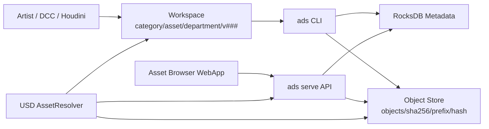
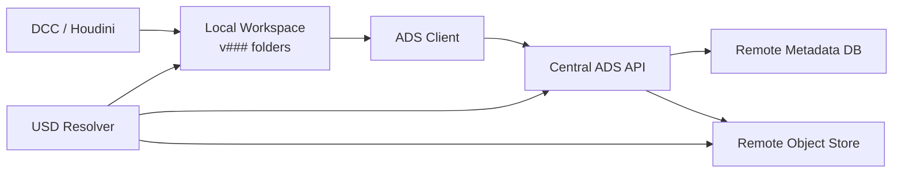
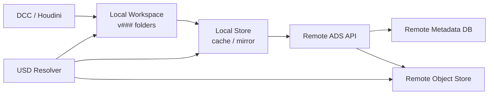

# ADS White Paper

## Rust製アセットバージョニングシステム

作成日: 2026-05-26  
最終更新: 2026-05-27

対象実装: ADS schema version 7

## Executive Summary

ADSは、DCCツール、特にUSDを扱う制作環境向けの軽量なアセットバージョニングシステムです。Rust製の単一バイナリとして提供され、ローカルファイルシステム上にRocksDBベースのメタデータDBとcontent-addressed object storeを構築します。

中心となる考え方は、作業用ファイルを常に物理的なversionフォルダに分離し、正規履歴はobject storeとmetadataに保持することです。

```text
<workspace>/<category>/<asset_code>/<department>/<version>
```

例:

```text
D:\workspace\char\hero\model\v001
D:\workspace\char\hero\model\v002
D:\workspace\char\hero\anim\v001
```

USDファイルはアプリケーションが開いている間にファイルロックや書き込み競合を起こすことがあります。ADSは同一パスを更新し続けるのではなく、`v001`, `v002` のように物理パスを分けることで、既存versionを不変に近い状態で扱い、編集開始時には次のversionフォルダを作成します。

また、USD AssetResolverを前提にした論理パスもサポートします。制作データ内では `ads://hero/model/hero.usd` のような短いURIを使い、実際にどのversion、どのローカルパス、どのObjectStorage URLへ解決するかはADS側で吸収する設計です。現状実装ではHoudini 21.0.700向けC++ `ArResolver` pluginにより、local workspace解決とremote object direct readの両方を検証済みです。

## 背景と課題

### DCC制作におけるアセット管理の難しさ

3D制作では、ひとつのアセットがmodel、rig、anim、lookdev、fxなど複数の作業区分に分かれます。さらに各作業区分は複数versionを持ち、USD、テクスチャ、補助ファイル、プレビュー画像などをフォルダ単位で扱うことが多くあります。

従来の一般的なVCSやPerforce型の運用では、同一ファイルパスを更新し、checkoutやlockで編集権を管理する方式が多く使われます。しかしUSDやDCCツールでは、ファイルを開いている状態のロック、アプリケーション固有のI/O挙動、共有ストレージ上の挙動差が問題になることがあります。

ADSはこの問題に対して、次の前提を置きます。

- 管理単位はファイルではなくフォルダ。
- 作業フォルダはversionごとに物理的に分ける。
- 登録済みversionは原則として同一内容を保つ。
- 正規データはobject storeに保存し、workspaceは作業用コピーとする。
- USDファイル内の参照はResolverで抽象化し、version指定を必要最小限にする。

## 設計原則

### 1. Version Folder First

ADSのworkspaceは、常にversionフォルダを持ちます。

```text
category/asset_code/department/v###
```

`department` は作業区分を表します。例えば `model`, `rig`, `anim`, `lookdev`, `fx` です。

この構造により、`v001` をHoudiniで開いたままでも、`v002` を別フォルダとして作成できます。既存versionを上書きしないため、USDファイルのロックやDCCアプリケーションの保持状態から正規ストアを守れます。

### 2. Store Is Canonical

workspaceのversionフォルダは作業用実体です。正規履歴はstoreにあります。

```text
<store>/
  db/
  objects/
    sha256/
      ab/
        abcd...
```

RocksDBはasset、version、manifest、current pointer、thumbnail metadataを保持します。実ファイル内容はSHA-256でcontent-addressed object storeに保存されます。

### 3. Content Deduplication

ファイル内容はSHA-256でハッシュ化され、同一内容のファイルは同一objectを参照します。version間で変更されていないファイルは再保存されません。

manifestは、フォルダ内の相対パス、ファイルサイズ、SHA-256、簡易modeから構成されます。ファイル走査順に依存しない安定したmanifest hashを作るため、entryは正規化されます。

### 4. Current By Default

ADSでは、通常参照は `current` を使います。`current` が明示的に設定されていない場合は `latest` と同等です。

これにより、USDやツール側では原則としてversion番号を明示せず、必要な場合だけ `v002` のようにpinできます。

```text
ads://hero/model/hero.usd
ads://hero/model/hero.usd?v=v002
ads://char/hero/model/hero.usd
```

### 5. Resolver-Oriented Access

ADSはローカルworkspaceから開く場合と、ObjectStorage風URLから直接読む場合の両方を想定します。

- local: workspace上のversionフォルダへ解決
- remote: object storeのURLへ解決
- auto: localに実体があればlocal、なければremote

USD/Houdini環境では、ADS用C++ `ArResolver` pluginにより、`ads://` URIをproduction scene内で自然に扱えるようにします。local modeではworkspace上のversion folderへ解決し、remote modeではcentral ADS APIとobject URLから直接読み込みます。

## システム構成



ADSは単一バイナリです。CLI、WebApp、HTTP API、静的HTML/CSS/JS配信は同じ実行ファイルに含まれます。

## Store運用モード

ADSの長期的な運用モデルは、制作環境のネットワーク条件に応じて2段階に分けます。

```text
1. remote store only
2. local + remote store
```

初期導入時の推奨defaultは `remote store only` です。チーム全体でひとつのcentral storeを正規データとして扱い、各作業PCはworkspaceだけを持ちます。ネットワーク負荷やVPN越しの遅延が問題になる現場では、local storeをcache/mirrorとして追加します。

### Remote Store Only

`remote store only` は、LAN、高速VPN、クラウドワークステーション、同一拠点内制作など、central storeへのアクセスが安定している環境向けです。



このモードでは、client側にRocksDBやobject storeを持ちません。

- remote storeが唯一のsource of truth。
- clientはworkspaceのversion folderだけを保持する。
- asset list、current/latest、manifest、thumbnailはcentral APIへ問い合わせる。
- WebAppとHTTP APIは起動時に許可されたprofileのstore/workspaceだけを扱う。
- `pull` / `restore` はprofileに紐づくworkspaceへ対象versionを展開する。
- Resolverは `ADS_RESOLVER_SERVER` とprofile/tokenを使ってcentral APIへ問い合わせ、remote object URLをnative HTTPで直接読む。
- Windows版Resolverのremote modeはWinHTTPを使い、`ads.exe` や `curl.exe` を起動しない。

利点は運用が単純なことです。正規データが一箇所に集まるため、local storeの同期ずれ、破損、世代差を考える必要がありません。WebAppもcentral APIを見るだけで済みます。

このモードはADSの将来defaultです。

### Local + Remote Store

`local + remote store` は、VPN、遠隔地、大容量テクスチャ、多数のUSD layer、回線が不安定な作業環境向けです。



このモードでは、remote storeを正規データとし、local storeはcacheまたはmirrorとして扱います。

- remote storeがcanonical。
- local storeは高速化、再利用、offline耐性のためのcache。
- `sync` または `fetch` でmetadata/objectをlocal storeへ取得する。
- workspaceへの `pull` はlocal storeから行う。
- localにないobjectはremoteへfallbackする。
- publish時はremote storeへ送信し、必要に応じてlocal storeも更新する。

利点はネットワーク負荷を下げられることです。同じasset/versionを繰り返し開く作業では、local storeがあることでHTTP/ObjectStorageへのアクセスを大幅に減らせます。

ただし、local storeはsource of truthではありません。同期状態、cache invalidation、object pruning、schema version差を扱う必要があるため、導入コストは `remote store only` より高くなります。

### コマンド設計方針

remote接続は、現状では `ads serve` をcentral APIとして起動し、`fetch` / `sync` / `push` でlocal storeと往復する形を実装しています。WebAppやResolverはcentral APIへ直接接続できます。

```powershell
ads sync `
  --server http://ads-server:8787 `
  --auth-token <token> `
  --profile main `
  --store D:\local-store `
  --workspace D:\workspace `
  --category char `
  --asset-code hero `
  --department model `
  --latest `
  --materialize
```

完全な「local storeなしCLI client mode」は未実装ですが、Houdini Resolverのremote modeはlocal storeを必要とせず、central APIとremote object URLだけでUSD layerを開けます。

local + remote storeでは、local storeを明示してpullし、remote storeとはsync/pushで接続します。

```powershell
ads sync `
  --store D:\local-store `
  --server http://ads-server:8787 `
  --auth-token <token> `
  --profile main `
  --category char `
  --asset-code hero `
  --department model

ads pull `
  --store D:\local-store `
  --workspace D:\workspace `
  --category char `
  --asset-code hero `
  --department model
```

この分離により、通常ユーザーには単純なremote store onlyを提供し、ネットワーク条件が厳しい現場だけlocal cacheを有効化できます。

## データモデル

### AssetKey

```text
category + asset_code
```

`category` は `env/city` のようなネストパスを許可します。

### DepartmentKey

```text
category + asset_code + department
```

version sequence、latest、current、thumbnailはdepartment単位で管理されます。

### VersionId

内部的には数値で保持し、表示は `v001`, `v002` 形式です。3桁を最低桁数とし、必要に応じて `v1000` のように拡張されます。

### VersionRecord

version recordは以下を保持します。

- department key
- version
- manifest hash
- created_at
- source_path
- file_count
- total_bytes

### Manifest

manifestはversionフォルダの内容を表します。

```text
relative_path
sha256
size
mode
```

mtime、所有者、絶対パスはversion同一性に含めません。これは制作環境や共有ストレージ間で変わりやすい情報を避けるためです。

### ThumbnailRecord

thumbnailはasset_code、department、versionに紐づくmetadataです。PNG、JPEG、WebPを対象とし、実体はobject storeにdedup保存されます。

## RocksDB Key設計

主なkey prefixは以下です。

```text
meta/schema_version
asset/<category>/<asset_code>
version/<category>/<asset_code>/<department>/<version>
latest/<category>/<asset_code>/<department>
current/<category>/<asset_code>/<department>
thumbnail/<category>/<asset_code>/<department>/<version>
manifest/<manifest_hash>
manifest_index/<category>/<asset_code>/<department>/<manifest_hash>
```

`manifest_index` は同一manifestの再登録検出に使われます。同一内容のversionフォルダを登録した場合、新しいversion recordは作らず、既存versionを返します。

## Object Store

object storeは以下のような構造です。

```text
objects/sha256/<prefix>/<hash>
```

例:

```text
objects/sha256/ab/abcdef...
```

ファイル内容、thumbnail画像ともに同じ仕組みで保存されます。これにより、version間で同一ファイルがある場合や、同一thumbnailが再利用される場合に重複保存を避けられます。

## Workspace Workflow

### Store初期化

```powershell
ads init D:\store
```

remote object URLを使う場合:

```powershell
ads init D:\store --remote-base-url https://assets.example.com/objects/sha256
```

### Asset作成

```powershell
ads asset create `
  --store D:\store `
  --workspace D:\workspace `
  --category char `
  --asset-code hero
```

### 新規version作成

```powershell
ads new-version `
  --store D:\store `
  --workspace D:\workspace `
  --category char `
  --asset-code hero `
  --department model
```

新規asset/departmentの場合は `v001` の空フォルダを作ります。既存departmentの場合は次のversionを作成し、latest versionの内容をコピーして編集開始できる状態にします。

### Version登録

```powershell
ads add `
  --store D:\store `
  --workspace D:\workspace `
  --category char `
  --asset-code hero `
  --department model `
  --version v001
```

登録対象は必ず以下の標準versionフォルダです。

```text
D:\workspace\char\hero\model\v001
```

同一version番号に異なる内容を登録しようとした場合は失敗します。同一manifestが既存versionにある場合は、新規versionを作らず既存versionを返します。

### Workspaceを更新する

通常操作は `pull` です。

```powershell
ads pull `
  --store D:\store `
  --workspace D:\workspace `
  --category char `
  --asset-code hero `
  --department model
```

`pull` はcurrentをworkspaceへ取得します。currentが未設定ならlatestを取得します。

latestを明示する場合:

```powershell
ads pull ... --latest
```

既存フォルダが同一manifestなら何もしません。既存フォルダが異なる内容なら失敗し、`--force` 指定時のみ置き換えます。

### 指定versionを復元する

```powershell
ads restore `
  --store D:\store `
  --workspace D:\workspace `
  --category char `
  --asset-code hero `
  --department model `
  --version v002
```

`restore` は明示versionを標準workspaceフォルダへ復元します。

### 任意場所へ取り出す

```powershell
ads checkout `
  --store D:\store `
  --category char `
  --asset-code hero `
  --department model `
  --version v002 `
  D:\temp\hero_model_v002
```

`checkout` は標準workspace構造に縛られない低レベル復元コマンドです。

## Current / Latest

latestは登録済みversionの最大値です。currentは明示的な参照versionです。

```powershell
ads current status --store D:\store --category char --asset-code hero --department model
ads current set --store D:\store --category char --asset-code hero --department model --version v002
ads current reset --store D:\store --category char --asset-code hero --department model
```

`current reset` 後は、currentはlatestに追従します。

この設計により、制作中のシーンやResolverは常に `current` を参照し、必要に応じてproduction側で安定versionをpinできます。

## ADS URIとResolver

ADSは次のようなURIを想定します。

```text
ads://hero/model
ads://hero/model/hero.usd
ads://hero/model/hero.usd?v=v002
ads://char/hero/model/hero.usd
```

categoryを省略した場合は、asset_codeとdepartmentから候補を解決します。categoryを明示したい場合は `ads://category/asset_code/department/path` の形式を使います。

CLIでの解決例:

```powershell
ads resolve `
  --store D:\store `
  --workspace D:\workspace `
  --mode auto `
  ads://hero/model/hero.usd
```

mode:

Texture系ファイルは、USD layerとは異なる解決ポリシーを使います。`.tx`, `.rat`, `.exr`, `.tif`, `.png`, `.jpg` などの予約拡張子、または `texture` / `textures` / `tex` department配下の非USDファイルはtextureとして扱います。`local` / `auto` resolveではworkspace上の論理パスではなく、DB上のmanifest entryからSHA-256を引き、`<workspace>/.ads-cache/sha256/<prefix>/<hash>.<ext>` へlocal cache化したパスを返します。USD layerである `.usd`, `.usda`, `.usdc`, `.usdz` は従来通りversion folder上の指定パスへ解決します。

同じ論理ファイル名のtextureを更新した場合も、versionごとにmanifest上のSHA-256が変わるため、cache上では別のhashファイルとして共存します。USD内の `ads://.../body_diffuse.1001.tx` 参照は安定したまま、`current` / `latest` / `?v=v001` の選択によって返るcache fileだけが変わります。`.ads-cache` は登録対象から除外されます。

- `local`: workspace上の実体ファイルへ解決
- `remote`: object URLへ解決
- `auto`: workspace上の実体ファイル、local store/cache、remote object URLの順に解決

remote URLはstoreに設定できます。

```powershell
ads set-remote `
  --store D:\store `
  --remote-base-url https://assets.example.com/objects/sha256
```

USD/Houdiniでは、C++ `ArResolver` pluginがこの解決を担当します。USDファイル内には極力 `ads://hero/model/hero.usd` のような論理パスを置き、versionや保存場所の変更をResolver側で吸収します。

local modeではResolverは `ads resolve` CLIへ委譲し、workspaceまたはlocal cache上のファイルを開きます。remote modeでは `ADS_RESOLVER_SERVER` で指定したcentral ADS APIの `/api/resolve` をC++から直接呼び出し、返されたobject URLをnative HTTPで読みます。WindowsではWinHTTP backendを使うため、remote解決中に `ads.exe` や `curl.exe` は起動しません。

remote store onlyでは、Resolverはcentral APIとremote object URLだけでUSD layerを開けます。local + remote storeでは、workspace、local store/cache、remote storeの順に探索する運用を選べます。

## Thumbnail Workflow

thumbnailはversion metadataとして扱います。

```powershell
ads thumbnail set `
  --store D:\store `
  --category char `
  --asset-code hero `
  --department model `
  --version v002 `
  D:\thumbs\hero.png
```

URL取得:

```powershell
ads thumbnail url `
  --store D:\store `
  --category char `
  --asset-code hero `
  --department model `
  --version v002
```

WebAppではthumbnail previewにremote URLを使います。remote URLが設定されていない場合はプレースホルダ表示になります。

## WebApp

ADSは `ads serve` でWebAppとJSON APIを提供します。

```powershell
ads serve `
  --bind 0.0.0.0:8787 `
  --auth-token <token> `
  --profile main=D:\store::D:\workspace
```

複数profileも指定できます。

```powershell
ads serve `
  --auth-token <token> `
  --profile main=D:\store::D:\workspace `
  --profile showA=D:\showA\store::D:\showA\workspace
```

WebAppはMegascans Bridge風の構成です。

- 左: profile、検索、category/department filter
- 中央: thumbnail grid
- 右: asset detail、ADS URI表示/コピー、version list、current操作、pull、thumbnail upload

初期版ではWebAppからversion作成やasset登録は行いません。WebAppは閲覧、ADS URIコピー、current管理、workspace pull、thumbnail uploadを主目的とします。

## HTTP API

主なAPIは以下です。

```text
GET  /api/profiles
GET  /api/assets
GET  /api/asset
GET  /api/versions
GET  /api/version
PUT  /api/version
GET  /api/object/status
GET  /api/object
PUT  /api/object
GET  /api/current/status
PUT  /api/current
POST /api/pull
POST /api/restore
POST /api/thumbnails
PUT  /api/thumbnail
GET  /api/thumbnail-url
GET  /api/resolve
```

互換用に `POST /api/materialize` も残していますが、通常は `/api/pull` または `/api/restore` を使います。

APIはBearer token必須です。

```text
Authorization: Bearer <token>
```

ブラウザから任意のローカルパスを指定することはできません。起動時に許可されたprofileのみを扱います。

## Python API

Phase 1では、Houdini Python環境で導入しやすいpure Python APIを提供します。Rust native extensionではなく、標準ライブラリのみで構成したthin APIです。

Python APIは2つの入口を持ちます。

- `AdsCli`: local `ads` executableをsubprocess経由で呼び出す。
- `AdsHttpClient`: `ads serve` のHTTP APIをBearer token付きで呼び出す。

`AdsCli` はlocal store運用やlocal + remote store運用の基礎になります。

```python
from ads import AdsCli

ads = AdsCli(r"D:\tools\ads.exe")
ads.pull(
    store=r"D:\store",
    workspace=r"D:\workspace",
    category="char",
    asset_code="hero",
    department="model",
)
```

`AdsHttpClient` はremote store only運用の基礎になります。

```python
from ads import AdsHttpClient

client = AdsHttpClient("http://ads-server:8787", token="secret")
assets = client.assets(profile="main", category="char", department="model")
client.pull(
    profile="main",
    category="char",
    asset_code="hero",
    department="model",
)
```

このAPIは、Houdini shelf tool、Python Panel、USD Resolver補助処理、社内publish toolからADSを呼び出すための最小レイヤーです。C++ Resolver pluginとは別に、Houdini UI、preflight、publish補助などの運用上の契約として使えます。

### USD Dependency Preflight

USD stageはroot layerから多数のreferences、payloads、sublayersを辿ります。ユーザーが明示的に開くファイルはrootだけですが、実際には多くの依存ファイルが必要です。

ADSでは、Resolverに副作用としてpullを実行させるのではなく、open前に依存関係を解析するpreflight utilityを使います。

```powershell
uv run ads-deps D:\shots\shot010\shot.usda `
  --store D:\store `
  --workspace D:\workspace
```

`ads-deps` はOpenUSD Pythonが利用できる場合は `UsdUtils.ComputeAllDependencies` を使い、root USDから全依存を収集します。その中の `ads://` URIだけをpull/restore対象として抽出します。

```powershell
uv run ads-deps D:\shots\shot010\shot.usda `
  --store D:\store `
  --workspace D:\workspace `
  --execute
```

この運用により、Houdiniでstageを開く前に必要なADS version folderをworkspaceへ揃えられます。local modeのResolverはその後、既に存在するlocal fileへ高速に解決するだけです。remote modeではpreflight pullなしでもobject URLから直接読めますが、多数layerや大容量textureを扱う場合はpreflightでlocal化した方が安定するケースがあります。

## C++ USD Resolver

`ads://` URIをUSD composition arcから直接扱うためのC++ `ArResolver` pluginを提供します。

Resolverはread-onlyです。ADS URIへの書き込みは行わず、作業者は明示的なworkspace version folderで編集し、`ads add` または `ads publish register` で登録します。

local modeでは、Resolverは `ads resolve` CLIへ委譲してworkspace上のローカルファイルパスまたはtexture cache pathへ解決し、USDの `ArFilesystemAsset` で開きます。

```text
USD / Houdini
  -> ArResolver receives ads://hero/model/hero.usd
  -> ads resolve --mode local ...
  -> D:/workspace/char/hero/model/v002/hero.usd
  -> ArFilesystemAsset opens the local file
```

local modeに必要な環境変数:

```powershell
$env:ADS_RESOLVER_EXECUTABLE = "D:\tools\ads.exe"
$env:ADS_RESOLVER_STORE = "D:\store"
$env:ADS_RESOLVER_WORKSPACE = "D:\workspace"
$env:ADS_RESOLVER_MODE = "local"
$env:PXR_PLUGINPATH_NAME = "D:\path\to\ads\resolver\build\houdini\resources"
```

`ADS_RESOLVER_MODE` のdefaultは `local` です。workspaceに対象versionが存在しない場合は、事前に `ads pull` を実行します。

remote modeでは、Resolverは `ads.exe` を呼び出さず、`ADS_RESOLVER_SERVER` で指定されたcentral ADS APIへ直接問い合わせます。`/api/resolve` が返すremote object URLをnative HTTP backendで取得し、USDへ `ArInMemoryAsset` として渡します。これはworkspaceにversion folderを生成しない読み取り経路です。

```text
USD / Houdini
  -> ArResolver receives ads://hero/model/hero.usd
  -> GET /api/resolve?profile=main&asset_path=ads://hero/model/hero.usd&mode=remote
  -> http://asset-server/objects/sha256/ab/abcd...
  -> native HTTP download
  -> ArInMemoryAsset opens the remote object bytes
```

remote modeに必要な環境変数:

```powershell
$env:ADS_RESOLVER_SERVER = "http://ads-server:8787"
$env:ADS_RESOLVER_PROFILE = "main"
$env:ADS_RESOLVER_API_TOKEN = "<token>"
$env:ADS_RESOLVER_MODE = "remote"
$env:PXR_PLUGINPATH_NAME = "D:\path\to\ads\resolver\build\houdini\resources"
```

WindowsではHTTP backendとしてWinHTTPを使います。そのため、remote modeの解決中に `ads.exe` や `curl.exe` のプロセスは起動しません。macOS/Linux向けには同じbackend境界でlibcurl等のnative library backendを追加する方針です。

Houdini向けにはremote mode起動用batchを提供します。

```bat
houdini\launch_ads_remote_houdini.bat http://127.0.0.1:8789 phase3 phase3-test-token D:\workspace
```

問題調査用に `ADS_RESOLVER_DEBUG=1` と `ADS_RESOLVER_LOG_FILE` を設定できます。

```powershell
$env:ADS_RESOLVER_DEBUG = "1"
$env:ADS_RESOLVER_LOG_FILE = "$env:TEMP\ads_resolver_houdini.log"
```

buildはHoudini toolkitの `hcustom.exe -U` を使います。

```powershell
.\resolver\build_houdini.ps1 -HoudiniRoot "C:\Program Files\Side Effects Software\Houdini 21.0.700"
```

検証済みの範囲:

- `Ar.GetResolver().Resolve("ads://...")`
- `Sdf.Layer.FindOrOpen("ads://...")`
- `ads://...` referenceを含むUSD stage open
- remote modeでのroot layer、payload、sublayer、texture objectの直接読み込み

remote object URLは直接読めます。ただし現状は対象object全体をmemoryにbufferするMVPです。production向けには、range request、streaming、retry、cache policyを備えた専用 `ArAsset` 実装へ発展させます。

## Houdini USD ROP Publish

SolarisではUSD ROPを使ってUSD layerを書き出します。ADSでは、USD ROPのOutput Processorとして `ADS Managed Publish` を提供します。

```text
Solaris LOP
  -> USD ROP
  -> ADS Managed Publish output processor
  -> public root
  -> version-pinned ads:// references
```

このOutput Processorは、`ADS_RESOLVER_WORKSPACE` 配下のsave pathを `ADS_OUTPUT_PUBLIC_ROOT` 配下へ写像できます。また、workspaceまたはpublic root配下の参照パスを `ads://category/asset_code/department/path?v=v###` へ変換します。

例:

```text
D:/workspace/char/hero/model/v003/geo/body.usd
  -> ads://char/hero/model/geo/body.usd?v=v003

D:/public/char/hero/texture/v002/maps/body.1001.tx
  -> ads://char/hero/texture/maps/body.1001.tx?v=v002
```

これにより、public出力先の物理パスが変わってもUSD内の参照はADS URIとして安定します。Resolverなしの外部納品ではなく、社内managed publishではこの方式をdefaultとします。

USD ROPで書き出したpublic version folderは、CLIから検証・登録できます。

```powershell
ads publish validate `
  --store D:\store `
  --public-root D:\public `
  --category char `
  --asset-code hero `
  --department model `
  --version v003

ads publish register `
  --store D:\store `
  --public-root D:\public `
  --category char `
  --asset-code hero `
  --department model `
  --version v003
```

`validate` はtext USD内の `@...@` asset pathを検査し、`ads://` ではない相対パス、絶対パス、`file://` 参照が残っていれば失敗します。binary USDの完全検査はHoudini/OpenUSD側のpreflightに委ね、CLIでは警告として扱います。

## セキュリティモデル

ADS WebAppはLAN内運用を想定しています。初期版のセキュリティ方針はシンプルです。

- `/api/*` はBearer token必須
- WebAppは起動時profile allowlistのみ参照
- ブラウザから任意store/workspace pathは入力不可
- thumbnail uploadはPNG、JPEG、WebPのみ許可
- upload sizeは `--max-upload-mb` で制限

一方で、初期版は組織認証、ユーザーごとの権限、監査ログ、ACL、署名URL発行などは実装しません。インターネット公開ではなく、信頼できるLANまたはVPN配下での運用を前提とします。

## USD / Houdini運用上の考え方

ADSはUSDのファイルロック問題だけを解決するものではありません。むしろ、USD Resolverと組み合わせることで、version管理、作業フォルダ、ObjectStorageアクセスを一貫して扱うための土台です。

推奨方針は以下です。

- 作業者は `v###` の物理フォルダで編集する。
- 登録済みversionは原則として変更しない。
- USD内参照は `ads://` URIを使う。
- versionを固定したい場合のみ `?v=v002` を使う。
- 通常参照はcurrentに任せる。
- latestを直接参照し続ける運用は、production publishでは避ける。

Windows環境でUSDファイルがロックされる場合でも、次versionフォルダを作ることで作業を進められます。LinuxやNFS環境でロック問題が発生しにくい場合でも、versionフォルダによる不変性と参照の明確化には価値があります。

## 整合性検査

`ads verify` はstoreの整合性を確認します。

```powershell
ads verify --store D:\store
```

検査対象:

- manifestが参照するobjectの存在
- object内容とSHA-256の一致
- version recordとmanifestの整合
- thumbnail metadataとobjectの整合

storeをバックアップする場合は、RocksDBの `db/` と `objects/` の両方を対象にする必要があります。

## 既知の制約

初期版の制約は以下です。

- store backendはlocal filesystem上のRocksDB/object store。remote accessは `ads serve` 経由で提供する。
- S3互換backendへの直接読み書きは未実装。
- `--server` 指定によるremote fetch/sync/pushは実装済みだが、全CLIを透過的にremote store onlyで扱うclient modeは未実装。
- local + remote storeの基本fetch/sync/pushは実装済み。conflict解決、差分push、object pruningは未実装。
- object garbage collectionは未実装。
- schema migrationは未実装。開発中storeは再作成前提。
- WebAppからのasset作成、new-version、addは未実装。
- multi-user lock、review、approval、publish gateは未実装。
- C++ USD Resolverのremote direct readはin-memory MVP。range request / streaming / retry policyは未実装。
- Windows Resolver remote modeはWinHTTP native backendを実装済み。macOS/Linux向けnative library backendは未実装で、今後libcurl等のlibrary backendを追加する方針。

これらは意図的に初期スコープ外としています。まずはversion folder、dedup store、Resolver向けURI、Web browserを最小構成で成立させることを優先しています。

## Roadmap

### Phase 1: MVP安定化

- README整備
- GitHub ActionsによるWindows build、test、clippy
- Python APIとHoudini向け導入手順
- CLI helpとエラーメッセージ改善
- 実制作データでのWindows/Houdini検証
- WebAppの失敗理由表示改善

### Phase 2: Resolver統合

Status: complete for local USD/Houdini integration. See `docs/PHASE2_COMPLETION.ja.md`.

- C++ USD AssetResolver prototype
- Houdini環境向けbuild scriptとpackage例
- `ads://` URIのproduction scene検証
- local/remote/auto解決の詳細仕様確定
- Houdini USD ROP output processor
- public publish validate/register

### Phase 3: Remote Store / Sync

Status: complete for remote store MVP. Base remote read/fetch/sync/push is described in `docs/PHASE3_REMOTE_SYNC.ja.md`; native remote Resolver details are reflected in this white paper and `resolver/README.md`.

- remote object direct read用 `ArAsset` MVP
- C++ Resolver native remote mode: `ADS_RESOLVER_SERVER` から `/api/resolve` を呼び、WindowsではWinHTTPでobjectを直接取得
- Houdini 21.0.700向けremote起動batch
- `ads fetch` によるremote version metadata/object取得
- `ads sync` によるfilter指定remote store同期
- `ads push` によるlocal version metadata/object送信
- remote store onlyを標準client modeとして扱う設計
- `--server <url>` によるcentral API接続
- metadata/objectのremote lookupとworkspace pull
- local + remote store向けのsync/fetch/push実装
- local storeをcache/mirrorとして扱う運用
- checksum検証付き転送
- WebAppでADS URI表示/コピー、thumbnail preview/upload、current/pull操作

### Phase 4: Production Governance

- publish state
- approval workflow
- user/audit metadata
- object GC
- schema migration
- role-based access control
- macOS/Linux向けResolver native HTTP backend
- remote object range request / streaming / retry policy

## 結論

ADSは、USDを含むDCC制作環境で「ファイルを直接上書きし続ける運用」から離れ、version folder、content-addressed storage、Resolver-oriented accessを組み合わせるための小さな基盤です。

特に重要なのは、versionを単なる番号ではなく、物理パス、manifest、object store、current pointer、Resolver URIをつなぐ共通概念として扱う点です。

この設計により、以下を同時に満たします。

- USD/Houdiniで開ける実体フォルダを維持する。
- version間の重複ファイルをdedupする。
- latest/currentを使い分ける。
- ブラウザでassetを探索できる。
- AssetResolverでlocal workspaceとremote object direct readを切り替えられる。
- 将来的にS3互換ObjectStorage、range read、production governanceへ拡張できる。

ADSの初期版は完成した制作管理システムではなく、堅牢なasset versioning layerです。remote store MVPとHoudini integrationはすでに成立しており、今後はS3互換backend、range read、cache policy、production governanceを段階的に追加していく段階です。
